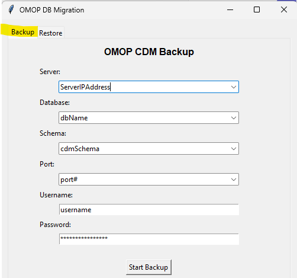

# OMOP DB Migration Tool
This program is a small desktop application for moving a PostgreSQL database into Microsoft SQL Server by using a two-step process:

**1. Backup:** export each PostgreSQL table to a CSV file.

**2. Restore:** create the SQL Server schema and bulk-load the CSV files into SQL Server.

## What the program does
The app has two tabs:

**Backup tab**

Connects to PostgreSQL and exports every base table in the chosen schema to a CSV file.

1. Only real tables are exported.
2. Views are ignored.
3. Each table is saved as CSV with a header row.
4. Output files are stored in a folder named after the database, for example:

		your_project/
		│
		├── main.py
		├── Log.log
		├── doc/
		├── ddl/
		│
		└── dbname/
			├── person.csv
			├── visit_occurrence.csv
			└── condition_occurrence.csv